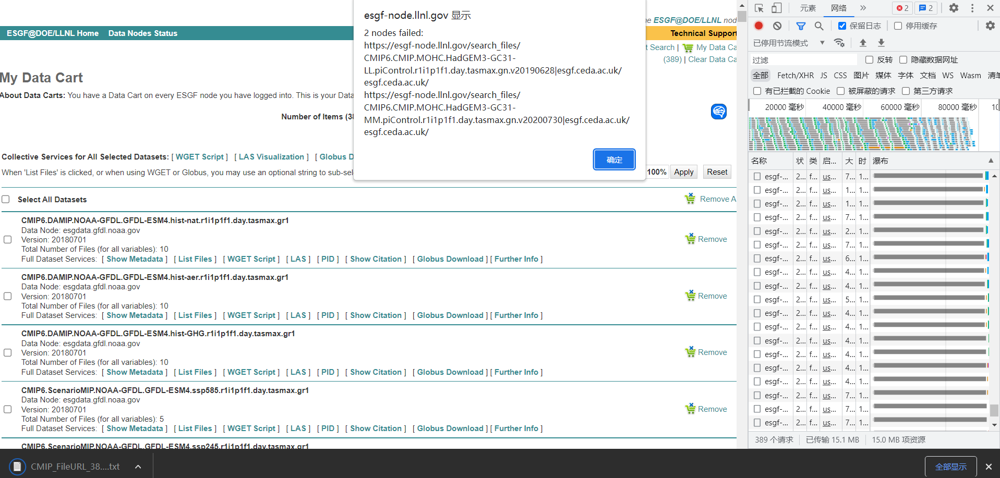

# CMIP6-assist

一些 CMIP6 的帮助工具

---

## 下载链接获取 (collect.js)

在 CMIP6 网站上添加一个按钮，一键获取当前页面所有 nc 文件的下载链接。文件搜索界面，亦或是购物车界面均可。

对于常见的下载方式，官方的 wget 限制文件数为 1000，难以处理大量文件；通过拼接文件链接下载，日期难以准确获得；其他第三方下载工具，使用较为麻烦，且处理不好断点续传。

因此，该方法解决了上述痛点。只负责获取链接，之后让更专业的工具管理下载的事情。

使用方法：油猴脚本导入

## 文件合并 (CMIP_merge.sh)

一个 sh 脚本，通过调用 CDO，对 CMIP6 文件不同时间进行合并。采取交互式操作，支持顺序、并行的处理方式。

